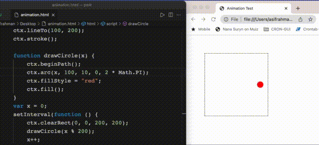

# Poor man's Live Reload


I was trying to make an animation using JavaScript on an Html canvas in a trial and error approach. My html was not hosted in any web server. Just opened the file in a browser from local storage. While fiddling with the code, it bothered me a lot to move between the code editor and the browser. Every time I made a change in code, I had to Cmd+Tab to switch to browser, hit Cmd+R to refresh and then again Cmd+Tab to return back to code editor. That's a lot to do. I wanted something that refreshes browser automatically whenever I make any change in the codes.


After Googling, I found a wonderful tool named LiveReload which does exactly what I need and some more. But it costs money. So, I thought, can I make it on my own? Well, I did some quackery and this is the result. It reloads Html file in browser automatically when source/target file is changed.





Update on 27-Dec-2021: Now can watch any/all file in a given dir


Todo:

- [ ] watch file list
- [ ] watch by file ext.


Requirement:

```
Node.js v17.0.1
npm v8.1.0
```

Setup:

```
git clone https://github.com/asiftyro/pmlr.git
cd full/path/to/pmlr/dir
npm i
```

Usage:

Add following two lines inside `<head>...</head>` of target Html file:

```
<script src="http://localhost:3000/socketiojs"></script>
<script src="http://localhost:3000/pmlr"></script>
```


To run the auto reloader:

```
In terminal:

// To watch a specific file for changes
cd full/path/to/pmlr/dir
node app.js full/path/of/target/file/to/watch

// To watch any/all file for changes under a dir - 
cd full/path/to/pmlr/dir
node app.js full/path/of/target/dir/to/watch
```


Now open the Html file in browser. Change code in the target file and save. Html file in browser should reload/refresh automatically.
To stop, press `Ctrl+C` in terminal.


Built on:
```
NodeJS v17.0.1
Socket.IO v4.3.2
macOS Monterey 12.0.1
```

Tested on:
```
macOS Monterey 12.0.1
Google Chrome 96.0.4664.55
```

Tested by [rkbi](https://github.com/rkbi) on:
```
ArchLinux 5.15.5-arch1-1
Firefox 94
```
